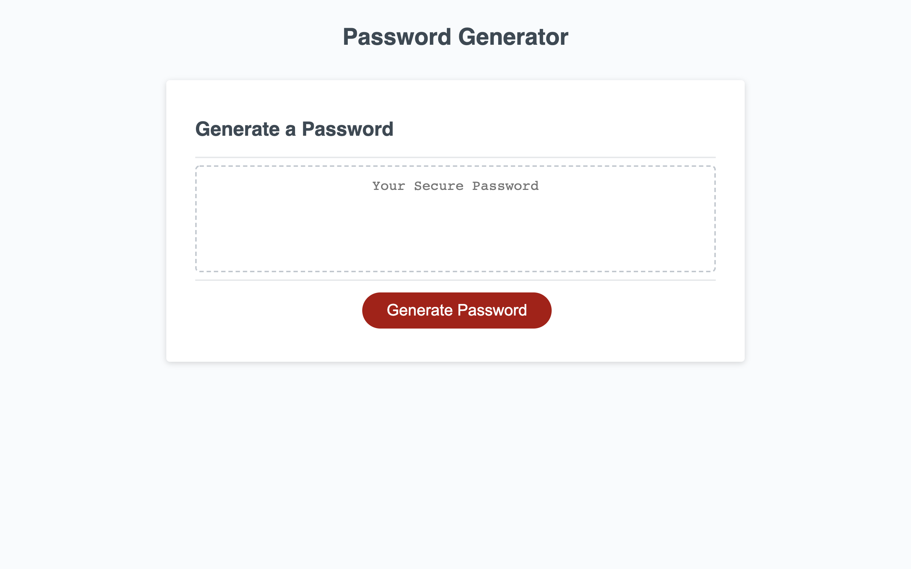

# Password Generator
## Purpose
Created to give users a random password with the ability to select to include or exclude certain criteria based on character type and password length

## How to Use
User will first type how long they want their password to be then will be prompted to select what type of characters to include or exclude, the choices being lowercase letters, uppercase letters, special characters, and numbers. The site will then generate a random password based on the user's selections.

Link to the site: https://chaldrich24.github.io/password-generator/ 

Screenshot:

